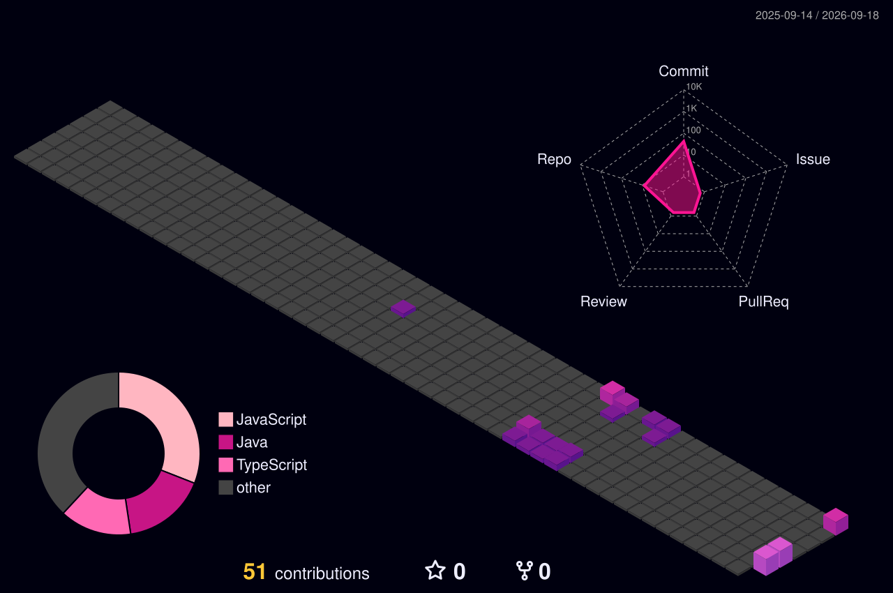

<!-- HERO SECTION -->

  
  
    
  
  <!-- Retro Title -->
  
  
   
  <a href="#-project-inventory"><code>[ PRESS START / EXPLORE ]</code></a>
    
  <i>Java • DSA • AI / GenAI • Backend • Computer Vision</i>

 

---

<!-- ABOUT ME -->

  <h3 style="color: #00FFFF;">🎮 ABOUT ME</h3>
  <table border="1" bordercolor="#00FFFF" cellpadding="15" width="90%" style="background-color: #0d1117; text-align: left;">
    <tr>
      <td width="60%" align="center" valign="top">
        
      </td>
      <td width="40%" valign="top">
        <small>
          Hi, I'm <b>Kritika</b> — a Computer Science student who likes turning ideas into things that actually work.  
          💻 I build <b>full-stack applications and backend systems</b>, working with Java, Python, JavaScript, REST APIs and modern web technologies.  
          🤖 I'm exploring <b>Generative AI, RAG and multi-agent systems</b>, building AI workflows that can retrieve, reason and act.  
          👁️ I also enjoy <b>Computer Vision</b>, especially projects involving real-time detection, spatial understanding and human movement.  
          🧠 Currently leveling up in <b>Java + DSA</b>, while going deeper into backend engineering and production-ready AI systems.  
          

            
<b>🏆 Along the way (Click to reveal)</b>

             
            <b>5+ live projects • 5 internships • open-source contributions • 3rd place at a national AI hackathon</b>
          

        </small>
      </td>
    </tr>
  </table>

 

---

<!-- SOCIAL CONTROL PANEL -->

  <h3 style="color: #00FFFF;">🕹️ CONTROL PLANNER (CONTACTS)</h3>
  <table border="1" bordercolor="#00FFFF" cellpadding="10" width="90%" style="background-color: #0d1117;">
    <tr>
      <th width="25%" style="color: #00FFFF;">🐙 GITHUB</th>
      <th width="25%" style="color: #00FFFF;">💼 LINKEDIN</th>
      <th width="25%" style="color: #00FFFF;">📧 EMAIL</th>
      <th width="25%" style="color: #00FFFF;">🌐 PORTFOLIO</th>
    </tr>
    <tr>
      <td align="center">
        
      </td>
      <td align="center">
        
      </td>
      <td align="center">
        
      </td>
      <td align="center">
        
      </td>
    </tr>
  </table>

---

<!-- CURRENT QUEST -->

  <h3 style="color: #00FFFF;">📜 CURRENT QUESTS</h3>
  <pre style="background-color: #0d1117; color: #00FFFF; border: 1px solid #00FFFF; padding: 15px; border-radius: 5px; width: 80%; text-align: left; font-family: 'Courier New', Courier, monospace;">
[████████░░] Master Java + DSA
[██████░░░░] Build GenAI systems
[████░░░░░░] Explore Computer Vision
[███░░░░░░░] Become a stronger Software Engineer
  </pre>

---

<!-- PROJECTS INVENTORY -->

  <h3 style="color: #00FFFF;">📌 PINNED REPOS (PROJECTS INVENTORY)</h3>
  
  
    
  
  
    
  
  

---

<!-- TECH STACK -->

  <h3 style="color: #00FFFF;">⚔️ INVENTORY (TECH STACK)</h3>
  <table border="1" bordercolor="#00FFFF" cellpadding="10" width="90%" style="background-color: #0d1117;">
    <tr>
      <th width="33%" style="color: #00FFFF;">💻 LANGUAGES</th>
      <th width="33%" style="color: #00FFFF;">🌐 WEB</th>
      <th width="33%" style="color: #00FFFF;">⚙️ BACKEND</th>
    </tr>
    <tr>
      <td align="center">
        <!-- [PLACEHOLDER 8: Skill Icons] -->
        
      </td>
      <td align="center">
        
      </td>
      <td align="center">
        
      </td>
    </tr>
    <tr>
      <th style="color: #00FFFF;">🤖 AI</th>
      <th style="color: #00FFFF;">🗄️ DATABASE</th>
      <th style="color: #00FFFF;">🛠️ TOOLS</th>
    </tr>
    <tr>
      <td align="center">
        <code>GenAI</code> <code>LLMs</code> 
        <code>RAG</code> <code>LangChain</code> 
        <code>LangGraph</code> <code>CV</code>
      </td>
      <td align="center">
          
        <code>ChromaDB</code>
      </td>
      <td align="center">
        
      </td>
    </tr>
  </table>

---

<!-- GITHUB ANALYTICS -->

  <h3 style="color: #00FFFF;">📊 DEVELOPER STATS</h3>
  
  <!-- [PLACEHOLDER 2: GitHub Streak] -->
  
  
    
  
  <!-- [PLACEHOLDER 3: 3D Contribution Graph] -->
  <picture>
    <source media="(prefers-color-scheme: dark)" srcset="profile-3d-contrib/profile-night-green.svg">
    <source media="(prefers-color-scheme: light)" srcset="profile-3d-contrib/profile-night-green.svg">
    
  </picture>

---

<!-- PROJECTS INVENTORY -->

  <h3 style="color: #00FFFF;" id="-project-inventory">🎒 PROJECT INVENTORY</h3>
  
  <table border="1" bordercolor="#00FFFF" width="90%" style="border-collapse: collapse; background-color: #0d1117;">
    <tr>
      <td width="50%" align="center">
        <b>👁️ PostureAI</b> 
        <i>Computer Vision / posture & fall detection</i>  
        <code>OpenCV</code> <code>Python</code> <code>MediaPipe</code>  
        
      </td>
      <td width="50%" align="center">
        <b>📊 ContriFlow</b> 
        <i>Open Source Intelligence platform</i>  
        <code>TypeScript</code> <code>React</code> <code>AI</code>  
        
      </td>
    </tr>
  </table>
   
  

---

<!-- ACHIEVEMENTS -->

  <h3 style="color: #00FFFF;">🏆 ACHIEVEMENT WALL</h3>
  <table border="1" bordercolor="#00FFFF" cellpadding="15" width="90%" style="background-color: #0d1117; text-align: left;">
    <tr>
      <td>🏆 <b>Hackathon Winner</b> — 3rd Place @ AgentathonX 2026 (National AI Hackathon); 6th Place @ Viveka Hackathon</td>
    </tr>
    <tr>
      <td>🤖 <b>Projects Completed</b> — 5+ live full-stack and AI projects deployed to production on Hugging Face Spaces</td>
    </tr>
    <tr>
      <td>📜 <b>Certifications Achieved</b> — Intro to Machine Learning (NPTEL, IIT Madras); Ethical Hacking & Networking (Netcamp)</td>
    </tr>
    <tr>
      <td>🚀 <b>Open Source Contributor</b> — GSSoC 2025 & ELUSOC 2025 (JavaScript/React.js contributions)</td>
    </tr>
  </table>

---

<!-- FOOTER -->

  
   
  <code>CODE • LEARN • BUILD • REPEAT</code>

